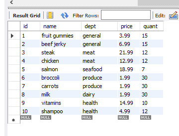
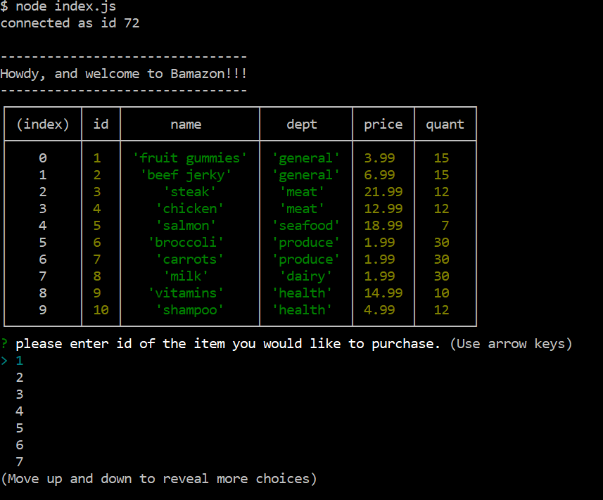
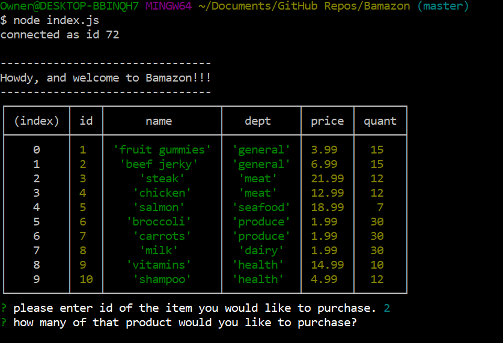
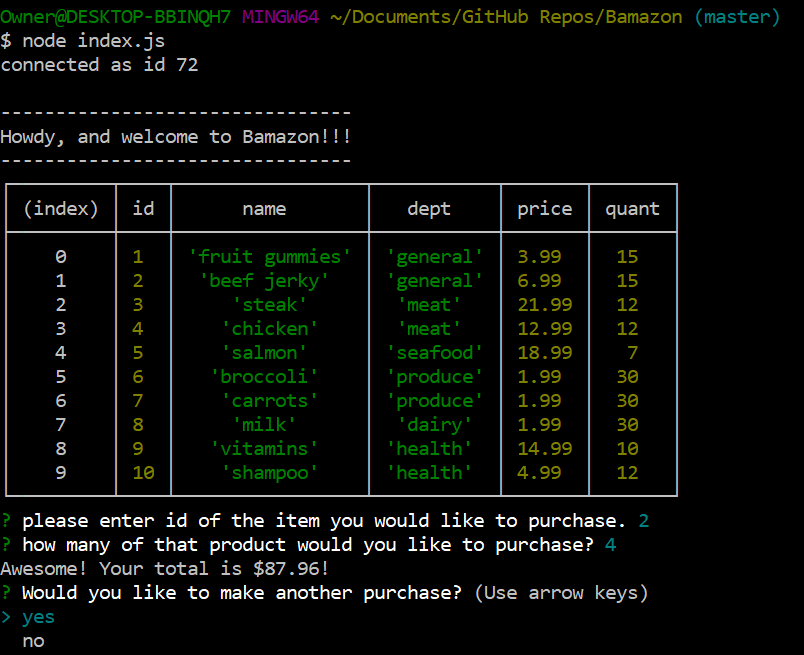
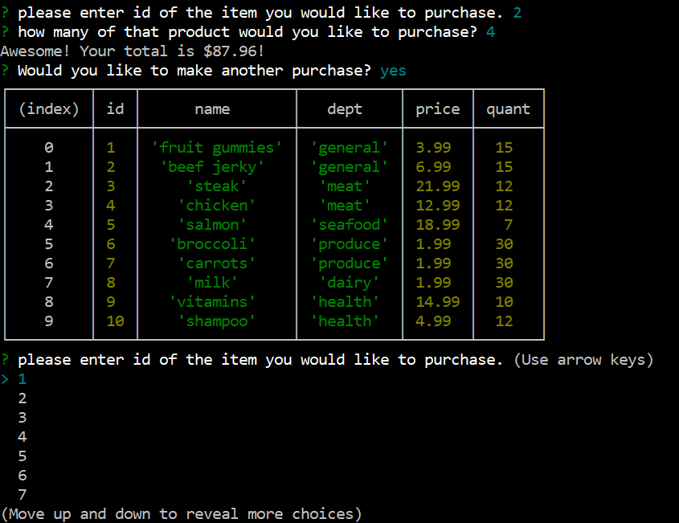
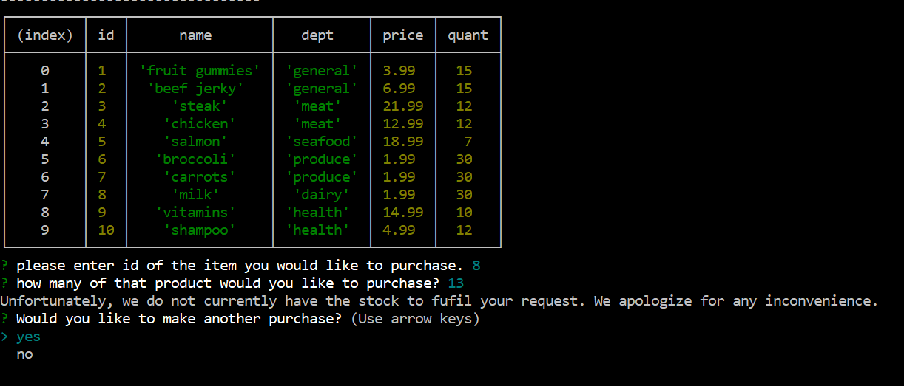
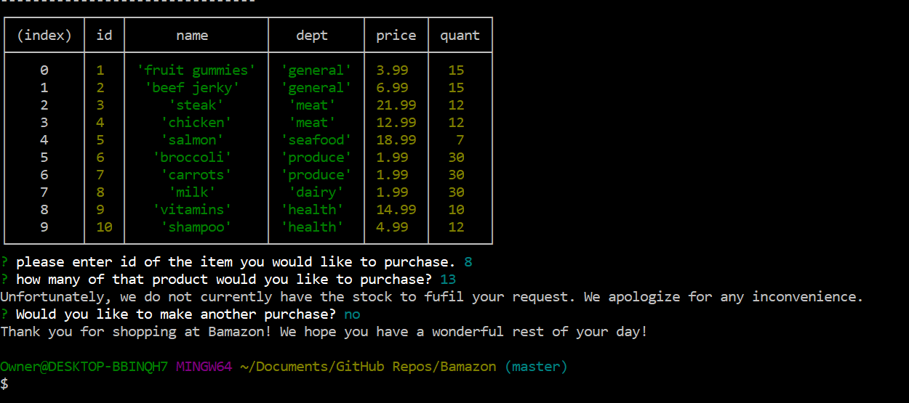

# Bamazon

Bamazon is a back-end based and driven store-front built with Node.js and MySQL which allows a customer to purchase one of ten items from a grocery list. 

 ## Requirements
 
Bamazon will require you to download the latest version of the MySQL workbench to your computer. You will also need to download the following npm packages to your computers terminal:
1. MySQL (npm install mysql)
1. Inquirer (npm install inquirer

 ### SQL Table
 
A MySQL table must look something like this in order to be compatible with this program:

### Communicating with the Online Storefront

The app can be executed by typing in node/nodemon index.js. No other arguments are needed. Open execution, the user is greeted to a table containing all the products carried by the online storefront. The user is prompted via the inquirer npm package to choose an item to purchase via its product code.

The user will then be asked to input how much of their chosen item they would like to purchase.

### Success or Failure
#### Success

If the user selects a quantity of their chosen item which can be fufilled by the store, then their total price of their purchase will be printed to the console like so:

##### Making another purchase

The user can then choose whether or not they would like to make another purchase. If they select yes, the app will restart to the opening screen. They can then make another purchase. All store quantity will replenish upon opting to make a second purchase.

#### Failure

However, if the user asks for a quantity which is greater than the store can provide, then the user will be told thus. The user will then be asked whether they would like to attempt to make another purchase.

##### Leaving the online store front

If the user decides to decline to make a new purchase, than the SQL connection ends and the user is taken out of the app, bringing the user back to the terminal.

